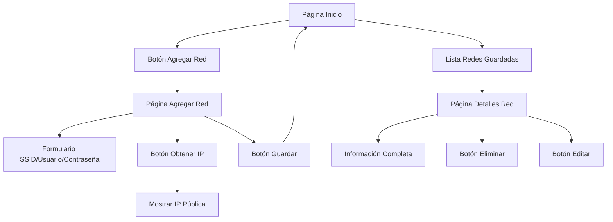

## 1. Descripción General del Producto

Aplicación móvil para Android que permite gestionar y almacenar credenciales de redes WiFi junto con la dirección IP pública actual. Los usuarios pueden guardar múltiples redes con sus respectivos usuarios y contraseñas, y visualizar toda la información guardada en una lista organizada.

La aplicación resuelve el problema de recordar credenciales de diferentes redes WiFi y proporciona un historial de conexiones con información de IP pública para referencia futura.

## 2. Funcionalidades Principales

### 2.1 Roles de Usuario

| Rol | Método de Acceso | Permisos Principales |
|------|---------------------|------------------|
| Usuario Estándar | Acceso directo a la app | Agregar, ver, editar y eliminar redes guardadas |

### 2.2 Módulo de Funcionalidades

Nuestra aplicación de gestión de credenciales de red consta de las siguientes páginas principales:

1. **Página de Inicio**: lista de redes guardadas, botón para agregar nueva red.
2. **Página de Agregar Red**: formulario para ingresar SSID, usuario, contraseña y obtener IP pública.
3. **Página de Detalles de Red**: muestra información completa de una red específica.

### 2.3 Detalles de Páginas

| Nombre de Página | Módulo | Descripción de Funcionalidad |
|-----------|-------------|---------------------|
| Página de Inicio | Lista de Redes | Muestra todas las redes WiFi guardadas con SSID y fecha de guardado. Permite navegar a detalles o agregar nueva red. |
| Página de Inicio | Botón Agregar | Navega a la página de formulario para agregar nueva red. |
| Página Agregar Red | Formulario SSID | Campo de texto para ingresar el nombre de la red WiFi (SSID). |
| Página Agregar Red | Formulario Usuario | Campo de texto para ingresar el nombre de usuario de la red. |
| Página Agregar Red | Formulario Contraseña | Campo de texto seguro para ingresar la contraseña de la red. |
| Página Agregar Red | Botón Obtener IP | Obtiene y muestra la dirección IP pública actual del dispositivo. |
| Página Agregar Red | Botón Guardar | Valida y guarda toda la información de la red con timestamp actual. |
| Página Detalles Red | Información Completa | Muestra SSID, usuario, contraseña, IP pública y fecha de guardado. |
| Página Detalles Red | Botón Eliminar | Permite eliminar la red guardada con confirmación. |
| Página Detalles Red | Botón Editar | Navega a modo edición para modificar credenciales. |

## 3. Flujo Principal de Usuario

El usuario abre la aplicación y ve la lista de redes guardadas. Puede tocar "Agregar Nueva Red" para ir al formulario donde ingresa SSID, usuario y contraseña. Al tocar "Obtener IP", la app captura la IP pública actual. Finalmente, guarda toda la información. Desde la lista principal, puede tocar cualquier red para ver detalles completos o eliminarla.

## 4. Diseño de Interfaz de Usuario

### 4.1 Estilo de Diseño

- **Colores primarios**: Azul (#2196F3) para elementos principales
- **Colores secundarios**: Gris claro (#F5F5F5) para fondos
- **Estilo de botones**: Redondeados con sombra sutil
- **Tipografía**: Roboto (nativa de Android), tamaños 16px para texto normal, 20px para títulos
- **Estilo de layout**: Tarjetas elevadas con espaciado consistente
- **Iconos**: Material Design Icons para consistencia con Android

### 4.2 Resumen de Diseño de Páginas

| Nombre de Página | Módulo | Elementos de UI |
|-----------|-------------|-------------|
| Página de Inicio | Lista de Redes | Tarjetas blancas elevadas mostrando SSID en negrita, fecha debajo en gris, separación de 8px entre elementos |
| Página Agregar Red | Formulario | Campos de entrada con bordes redondeados, etiquetas flotantes, botón primario azul de ancho completo |
| Página Detalles Red | Información | Texto monoespaciado para credenciales, iconos de copiar al portapapeles, botones de acción en la parte inferior |

### 4.3 Adaptabilidad

Diseño mobile-first optimizado para Android, adaptación automática a diferentes tamaños de pantalla, soporte para modo portrait y landscape con reorganización de elementos.