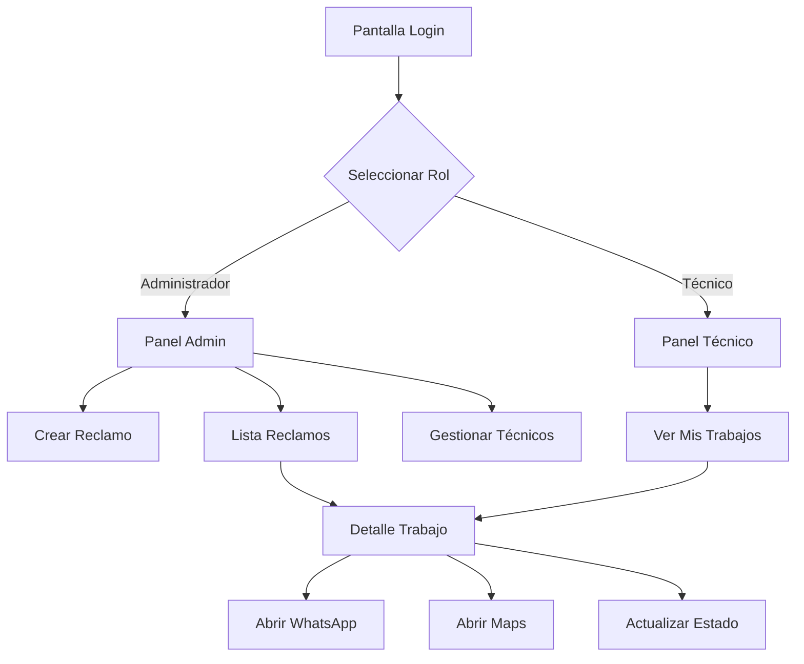

## 1. Descripción del Producto

Aplicación móvil para gestión de trabajos y reclamos de servicios de telecomunicaciones (fibra óptica, ADSL, TV, teléfono fijo). Permite a los administradores crear reclamos y a los técnicos visualizar, actualizar el estado y navegar a las ubicaciones de los clientes con integración de WhatsApp para comunicación directa.

- **Problema a resolver**: Gestión ineficiente de trabajos de campo en telecomunicaciones
- **Usuarios**: Administradores (jefes) y Técnicos de campo
- **Valor**: Optimización del tiempo de respuesta y seguimiento en tiempo real de trabajos

## 2. Funcionalidades Principales

### 2.1 Roles de Usuario

| Rol | Método de Registro | Permisos Principales |
|------|---------------------|------------------|
| Administrador | Registro por email | Crear reclamos, ver todos los trabajos, gestionar técnicos |
| Técnico | Registro por email (aprobado por admin) | Ver trabajos asignados, actualizar estado, acceder a navegación y WhatsApp |

### 2.2 Módulos de Funcionalidades

La aplicación consta de las siguientes pantallas principales:

1. **Pantalla de Login**: Autenticación de usuarios, selección de rol
2. **Panel Administrador**: Lista de reclamos, formulario de nuevo reclamo, gestión de técnicos
3. **Panel Técnico**: Lista de trabajos asignados, detalles del trabajo, actualización de estado
4. **Detalle del Trabajo**: Información del cliente, servicio, dirección, botones de acción

### 2.3 Detalle de Pantallas

| Pantalla | Módulo | Descripción de Funcionalidades |
|-----------|-------------|---------------------|
| Login | Autenticación | Ingresar email y contraseña, seleccionar rol (Admin/Técnico) |
| Panel Admin | Lista de Reclamos | Ver todos los reclamos con filtros por estado, fecha, técnico asignado |
| Panel Admin | Nuevo Reclamo | Crear reclamo con: tipo de servicio, datos del cliente, dirección, descripción del problema |
| Panel Admin | Gestión Técnicos | Ver lista de técnicos, asignar trabajos, ver rendimiento |
| Panel Técnico | Mis Trabajos | Ver lista de trabajos asignados con estado (Pendiente/En proceso/Completado) |
| Panel Técnico | Mapa de Trabajos | Ver ubicación de todos los trabajos asignados en mapa |
| Detalle Trabajo | Info Cliente | Mostrar: nombre, dirección, teléfono, tipo de servicio, descripción del problema |
| Detalle Trabajo | Acciones | Botón "Abrir en WhatsApp" (con número pre-cargado), Botón "Navegar" (abrir maps con dirección), Actualizar estado |
| Detalle Trabajo | Historial | Ver registro de cambios de estado y observaciones |

## 3. Flujo de Procesos Principales

### Flujo del Administrador
1. El administrador inicia sesión y accede al panel principal
2. Crea un nuevo reclamo completando el formulario con datos del cliente y el problema
3. El sistema guarda el reclamo y permite asignar un técnico
4. Puede monitorear el progreso de todos los reclamos en tiempo real

### Flujo del Técnico
1. El técnico inicia sesión y ve su lista de trabajos asignados
2. Selecciona un trabajo para ver los detalles completos
3. Utiliza el botón de navegación para llegar a la ubicación del cliente
4. Al completar el trabajo, actualiza el estado a "Completado"
5. Puede usar WhatsApp para comunicarse con el cliente si es necesario

## 4. Diseño de Interfaz de Usuario

### 4.1 Estilo de Diseño
- **Colores principales**: Azul corporativo (#0066CC) y blanco
- **Colores secundarios**: Verde para estados completados (#28a745), rojo para pendientes (#dc3545)
- **Estilo de botones**: Redondeados con sombra sutil, iconos de acción claros
- **Tipografía**: Fuente sans-serif moderna (Roboto), tamaños: 16px para texto normal, 20px para títulos
- **Diseño general**: Tarjetas de información, navegación por pestañas inferior, iconos intuitivos
- **Iconos**: Material Design Icons para consistencia

### 4.2 Diseño por Pantalla

| Pantalla | Módulo | Elementos de UI |
|-----------|-------------|-------------|
| Login | Formulario | Logo centrado, campos de email/contraseña, selector de rol, botón azul principal |
| Panel Admin | Lista | Tarjetas de reclamos con: ID, cliente, tipo servicio, estado (badge color), fecha, técnico asignado |
| Panel Admin | Formulario | Campos organizados por secciones: Datos cliente, Tipo servicio (dropdown), Dirección (con validación), Descripción (textarea) |
| Panel Técnico | Lista | Tarjetas más compactas: dirección resumida, tipo servicio, hora, indicador de distancia |
| Detalle Trabajo | Información | Sección superior con datos cliente, mapa pequeño con ubicación, sección de acciones con 3 botones principales |
| Detalle Trabajo | Acciones | Botón WhatsApp (verde con ícono), Botón Maps (azul con ícono), Selector de estado (dropdown) |

### 4.3 Adaptabilidad
- **Primero móvil**: Diseño optimizado para smartphones (360px+)
- **Adaptable a tablets**: Layout responsive para pantallas de 7" y 10"
- **Optimización táctil**: Botones mínimo 48px, espaciado generoso, gestos de swipe para navegación

### 4.4 Integración con Servicios Externos
- **WhatsApp**: Botón que abre WhatsApp con número de cliente pre-cargado usando API `whatsapp://send?phone=`
- **Google Maps**: Botón que abre Maps con dirección usando `geo:` o Google Maps URL scheme
- **Geolocalización**: Obtener ubicación actual del técnico para cálculo de rutas óptimas