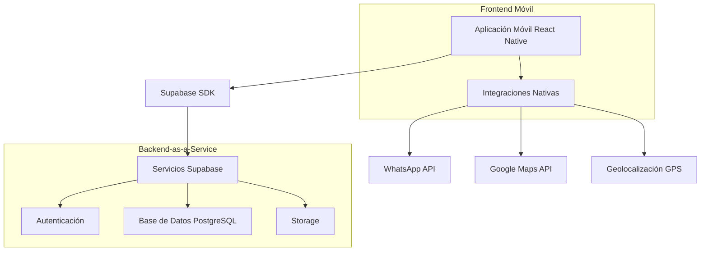
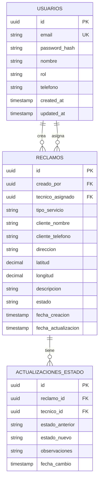

## 1. Diseño de Arquitectura



## 2. Descripción de Tecnologías

- **Frontend Móvil**: React Native + Expo CLI
- **Lenguaje**: TypeScript
- **Base de Datos**: Supabase (PostgreSQL)
- **Autenticación**: Supabase Auth
- **Gestión de Estado**: React Context + useState
- **Navegación**: React Navigation v6
- **Inicialización**: Expo CLI
- **Mapas**: react-native-maps
- **Geolocalización**: expo-location

## 3. Definición de Rutas

| Ruta | Propósito |
|-------|---------|
| /login | Pantalla de autenticación inicial |
| /admin/dashboard | Panel principal del administrador |
| /admin/crear-reclamo | Formulario para nuevos reclamos |
| /admin/gestionar-tecnicos | Lista y gestión de técnicos |
| /tecnico/dashboard | Panel principal del técnico |
| /tecnico/mis-trabajos | Lista de trabajos asignados |
| /tecnico/trabajo/:id | Detalles del trabajo específico |
| /tecnico/mapa-trabajos | Mapa con ubicaciones de trabajos |

## 4. Definiciones de API

### 4.1 Autenticación

```
POST /auth/v1/token
```

Request:
```json
{
  "email": "usuario@ejemplo.com",
  "password": "contraseña123",
  "role": "admin" | "tecnico"
}
```

Response:
```json
{
  "access_token": "eyJhbGciOiJIUzI1NiIsInR5cCI6IkpXVCJ9...",
  "refresh_token": "def50200...",
  "user": {
    "id": "uuid",
    "email": "usuario@ejemplo.com",
    "role": "admin"
  }
}
```

### 4.2 Gestión de Reclamos

```
GET /rest/v1/reclamos
POST /rest/v1/reclamos
PUT /rest/v1/reclamos/:id
```

Request (POST):
```json
{
  "tipo_servicio": "fibra_optica" | "adsl" | "tv" | "telefono",
  "cliente_nombre": "Juan Pérez",
  "cliente_telefono": "+541112345678",
  "direccion": "Calle Falsa 123, Buenos Aires",
  "latitud": -34.6037,
  "longitud": -58.3816,
  "descripcion": "Sin conexión a internet",
  "tecnico_asignado": "uuid-tecnico",
  "estado": "pendiente" | "en_proceso" | "completado"
}
```

## 5. Modelo de Datos

### 5.1 Diagrama Entidad-Relación



### 5.2 Definiciones SQL

**Tabla usuarios:**
```sql
CREATE TABLE usuarios (
    id UUID PRIMARY KEY DEFAULT gen_random_uuid(),
    email VARCHAR(255) UNIQUE NOT NULL,
    password_hash VARCHAR(255) NOT NULL,
    nombre VARCHAR(100) NOT NULL,
    rol VARCHAR(20) NOT NULL CHECK (rol IN ('admin', 'tecnico')),
    telefono VARCHAR(20),
    created_at TIMESTAMP WITH TIME ZONE DEFAULT NOW(),
    updated_at TIMESTAMP WITH TIME ZONE DEFAULT NOW()
);

-- Índices para búsquedas rápidas
CREATE INDEX idx_usuarios_email ON usuarios(email);
CREATE INDEX idx_usuarios_rol ON usuarios(rol);
```

**Tabla reclamos:**
```sql
CREATE TABLE reclamos (
    id UUID PRIMARY KEY DEFAULT gen_random_uuid(),
    creado_por UUID NOT NULL REFERENCES usuarios(id),
    tecnico_asignado UUID REFERENCES usuarios(id),
    tipo_servicio VARCHAR(20) NOT NULL CHECK (tipo_servicio IN ('fibra_optica', 'adsl', 'tv', 'telefono')),
    cliente_nombre VARCHAR(100) NOT NULL,
    cliente_telefono VARCHAR(20) NOT NULL,
    direccion TEXT NOT NULL,
    latitud DECIMAL(10, 8),
    longitud DECIMAL(11, 8),
    descripcion TEXT NOT NULL,
    estado VARCHAR(20) NOT NULL DEFAULT 'pendiente' CHECK (estado IN ('pendiente', 'en_proceso', 'completado')),
    fecha_creacion TIMESTAMP WITH TIME ZONE DEFAULT NOW(),
    fecha_actualizacion TIMESTAMP WITH TIME ZONE DEFAULT NOW()
);

-- Índices para consultas frecuentes
CREATE INDEX idx_reclamos_tecnico ON reclamos(tecnico_asignado);
CREATE INDEX idx_reclamos_estado ON reclamos(estado);
CREATE INDEX idx_reclamos_fecha ON reclamos(fecha_creacion DESC);
```

**Tabla actualizaciones_estado:**
```sql
CREATE TABLE actualizaciones_estado (
    id UUID PRIMARY KEY DEFAULT gen_random_uuid(),
    reclamo_id UUID NOT NULL REFERENCES reclamos(id),
    tecnico_id UUID NOT NULL REFERENCES usuarios(id),
    estado_anterior VARCHAR(20) NOT NULL,
    estado_nuevo VARCHAR(20) NOT NULL,
    observaciones TEXT,
    fecha_cambio TIMESTAMP WITH TIME ZONE DEFAULT NOW()
);

CREATE INDEX idx_actualizaciones_reclamo ON actualizaciones_estado(reclamo_id);
CREATE INDEX idx_actualizaciones_fecha ON actualizaciones_estado(fecha_cambio DESC);
```

### 5.3 Políticas de Seguridad (RLS)

```sql
-- Políticas para reclamos
-- Los admins pueden ver todos los reclamos
CREATE POLICY "Admins ven todos reclamos" ON reclamos
    FOR SELECT USING (auth.uid() IN (SELECT id FROM usuarios WHERE rol = 'admin'));

-- Los técnicos solo ven sus reclamos asignados
CREATE POLICY "Técnicos ven sus reclamos" ON reclamos
    FOR SELECT USING (tecnico_asignado = auth.uid());

-- Solo admins pueden crear reclamos
CREATE POLICY "Admins crean reclamos" ON reclamos
    FOR INSERT WITH CHECK (auth.uid() IN (SELECT id FROM usuarios WHERE rol = 'admin'));

-- Técnicos pueden actualizar estado de sus reclamos
CREATE POLICY "Técnicos actualizan sus reclamos" ON reclamos
    FOR UPDATE USING (tecnico_asignado = auth.uid() AND estado IN ('en_proceso', 'completado'));
```

## 6. Configuración de Expo

**app.json:**
```json
{
  "expo": {
    "name": "Telecom Field Service",
    "slug": "telecom-field-service",
    "version": "1.0.0",
    "orientation": "portrait",
    "permissions": [
      "LOCATION",
      "CAMERA",
      "CAMERA_ROLL"
    ],
    "plugins": [
      "expo-location",
      [
        "expo-camera",
        {
          "cameraPermission": "La aplicación necesita acceso a la cámara para documentar trabajos."
        }
      ]
    ]
  }
}
```

## 7. Dependencias Principales

```json
{
  "dependencies": {
    "@supabase/supabase-js": "^2.38.0",
    "@react-navigation/native": "^6.1.7",
    "@react-navigation/bottom-tabs": "^6.5.8",
    "@react-navigation/stack": "^6.3.17",
    "react-native-maps": "^1.7.1",
    "expo-location": "~16.1.0",
    "expo-linking": "~5.0.2",
    "react-native-paper": "^5.10.1",
    "react-native-safe-area-context": "4.6.3",
    "react-native-screens": "~3.22.0"
  }
}
```